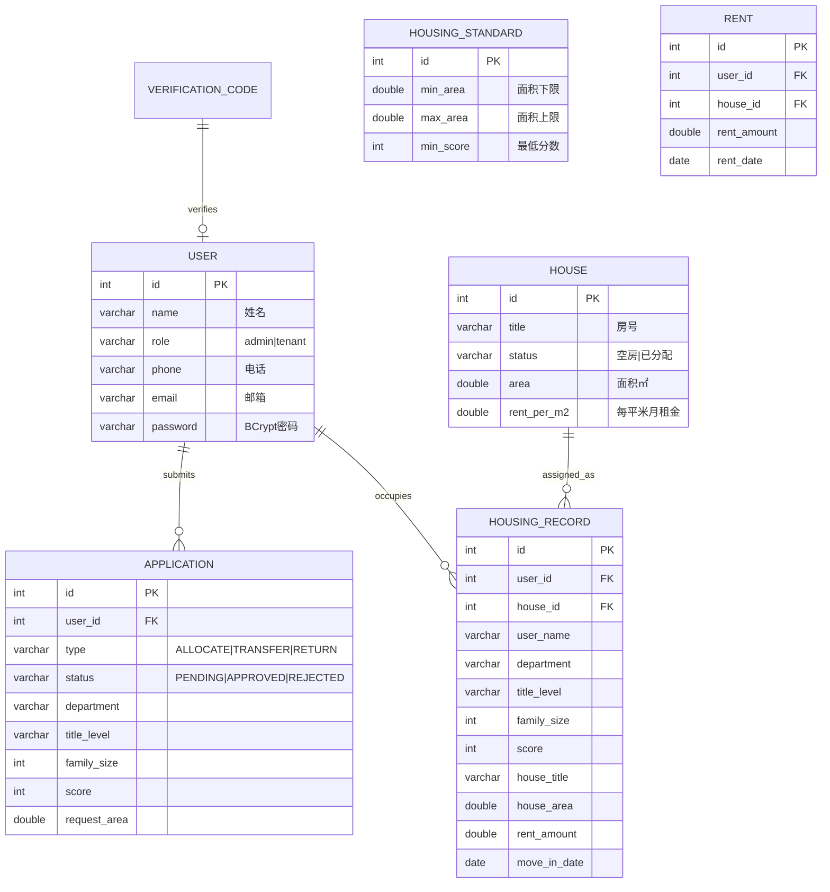

# 房产管理系统

> 
> 
> 房屋资源管理 + 用户住房申请，支持分房、调房、退房、统计查询

---

## 一、技术栈

| 层级  | 技术                     |
| --- | ---------------------- |
| 数据库 | MySQL                  |
| ORM | MyBatis                |
| 后端  | Java + Spring Boot 3.x |
| 前端  | Vue 3 + Vite           |
| 安全  | BCrypt 密码加密 + 角色权限     |

---

## 二、项目结构

```
project/
├── database/
│   ├── house_db.sql              # 建库脚本（全新安装）
│   └── migration_v2.sql           # 迁移脚本（旧库升级）
├── backend/HouseBackend/
│   └── src/main/java/org/example/housebackend/
│       ├── controller/            # REST 控制器（含 AuthController）
│       ├── service/               # 业务逻辑 + EmailService
│       ├── mapper/                # MyBatis 接口 + XML
│       └── entity/                # 实体类
├── frontend/src/views/            # Vue 页面（8 个）
├── logs/                          # 开发日志
├── 使用指南.md
└── README.md
```

---

## 三、数据库设计

### 3.1 ER 图



### 3.2 住房标准（面积范围）

| 等级  | 面积范围     | 最低分数 | 覆盖房屋         |
| --- | -------- | ---- | ------------ |
| 第1级 | 0~60㎡    | 60   | A栋（30-55㎡）   |
| 第2级 | 60~80㎡   | 80   | B/C栋（60-85㎡） |
| 第3级 | 80~120㎡  | 100  | D栋（90-120㎡）  |
| 第4级 | 120~160㎡ | 120  | E栋（130-150㎡） |

---

## 四、评分公式

| 维度              | 分值             |
| --------------- | -------------- |
| 计算机/电子信息学院      | 30             |
| 数理化生学院          | 25             |
| 经管/法学/外语/马克思学院  | 20             |
| 后勤/图书馆/校机关      | 15             |
| 教授/副教授/讲师/助教/其他 | 50/40/30/20/10 |
| 家庭人数            | 每人 5 分         |

---

## 五、分房流程

```
提交申请 → 计算分数 → 匹配面积等级 → 分数 ≥ 阈值？
  → 是：在同等级空房中选面积最大的 → 创建住房记录 → 写房租表
  → 否：申请拒绝
  → 该等级无空房：保持待审批
```

---

## 六、API 接口

| 方法                  | 路径                            | 说明                     |
| ------------------- | ----------------------------- | ---------------------- |
| POST                | `/auth/login`                 | 登录（账号 + 密码）            |
| POST                | `/auth/register`              | 注册（邮箱 + 验证码 + 姓名 + 密码） |
| POST                | `/auth/send-code`             | 发送邮箱验证码                |
| GET/POST/PUT/DELETE | `/houses`                     | 房屋 CRUD                |
| GET/POST/PUT/DELETE | `/users`                      | 用户 CRUD                |
| GET/POST            | `/applications`               | 申请列表 / 提交              |
| PUT                 | `/applications/{id}/approve`  | 分房（返回结果消息）             |
| PUT                 | `/applications/{id}/transfer` | 调房                     |
| PUT                 | `/applications/{id}/release`  | 退房                     |
| GET                 | `/records`                    | 住房记录                   |
| GET                 | `/records/{id}/receipt`       | 住房分配单                  |
| GET/POST/PUT/DELETE | `/standards`                  | 住房标准 CRUD              |
| GET                 | `/stats`                      | 综合统计                   |
| GET                 | `/stats/threshold?area=`      | 按面积查阈值                 |
| GET                 | `/stats/rent?title=`          | 按房号查租金                 |

---

## 七、快速开始

```bash
# 1. 数据库
mysql -u root -p < database/house_db.sql

# 2. 后端（端口 8080）
cd backend/HouseBackend && ./mvnw spring-boot:run

# 3. 前端（端口 5173）
cd frontend && npm install && npm run dev

# 4. 打开 http://localhost:5173
```

> 邮件验证码需配置 `secret.properties`（QQ邮箱 SMTP），已通过 .gitignore 排除。

---

## 八、测试账号

| 角色  | 姓名  | 邮箱                    | 密码       |
| --- | --- | --------------------- | -------- |
| 管理员 | 张三  | zhangsan@test.com     | admin123 |
| 住户  | 李四  | lisi@test.com         | 123456   |
| 住户  | 王教授 | wangjiaoshou@test.com | 123456   |

---

## 九、当前进度

| 功能             | 状态  |
| -------------- | --- |
| 数据库 6 表        | ✅   |
| 后端 CRUD        | ✅   |
| 登录 + 注册 + 邮箱验证 | ✅   |
| 角色权限控制         | ✅   |
| 分房/调房/退房       | ✅   |
| 评分公式 + 等级匹配    | ✅   |
| 统计查询           | ✅   |
| 住房分配单 + 打印     | ✅   |
| 前端毛玻璃 UI + 动画  | ✅   |
| 首页仪表盘          | ✅   |
| 30 套房屋 + 10 用户 | ✅   |
