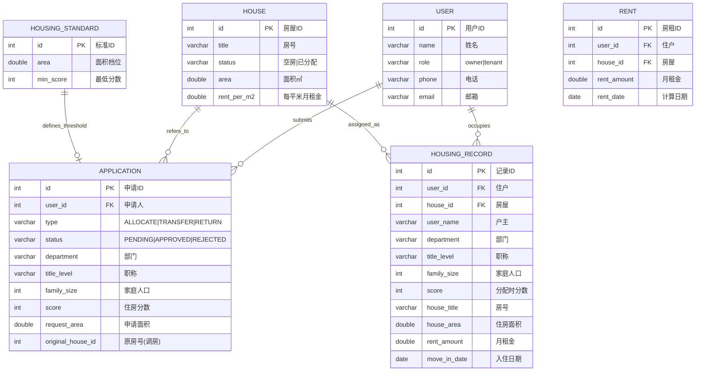

# 房产管理系统

> 数据库课程设计 — 题目第6题
>
> 系统用于房屋资源管理和用户住房申请管理，支持**分房、调房、退房和咨询统计**。

---

## 一、技术栈

| 层级 | 技术 | 说明 |
|---|---|---|
| 数据库 | MySQL 9.7 | 关系型数据库 |
| ORM | MyBatis | SQL 映射 |
| 后端 | Java + Spring Boot 3.x | REST API |
| 前端 | Vue 3 + Vite | 响应式页面 |
| HTTP | Axios | 前后端通信 |

---

## 二、项目结构

```
project/
├── database/                  # 数据库脚本
│   ├── house_db.sql           #   建库脚本（全新安装用）
│   └── migration_v2.sql       #   迁移脚本（旧库升级用）
├── backend/HouseBackend/      # Spring Boot 后端
│   └── src/main/java/org/example/housebackend/
│       ├── controller/        # 6 个 REST 控制器
│       ├── service/           # 业务逻辑层
│       ├── mapper/            # MyBatis 接口 + XML 映射
│       └── entity/            # 6 个实体类
├── frontend/src/views/        # Vue 前端页面（6 个）
├── logs/                      # 开发日志
├── 使用指南.md                 # 详细使用说明
└── README.md                  # 本文档
```

---

## 三、数据库设计

### 3.1 ER 图



### 3.2 表结构

#### user（用户表）

| 字段 | 类型 | 说明 |
|---|---|---|
| id | INT PK | 用户ID |
| name | VARCHAR(50) | 姓名 |
| role | VARCHAR(20) | owner（管理员）/ tenant（住户） |
| phone | VARCHAR(20) | 电话 |
| email | VARCHAR(100) | 邮箱 |

#### house（房产表）

| 字段 | 类型 | 说明 |
|---|---|---|
| id | INT PK | 房屋ID |
| title | VARCHAR(100) | 房号（如 A101） |
| status | VARCHAR(20) | 空房 / 已分配 |
| area | DOUBLE | 住房面积（㎡） |
| rent_per_m2 | DOUBLE | 每平方米月租金（元） |

#### application（申请表）

| 字段 | 类型 | 说明 |
|---|---|---|
| id | INT PK | 申请ID |
| user_id | INT FK | 申请人 |
| house_id | INT FK | 目标房屋 |
| type | VARCHAR(20) | ALLOCATE（分房）/ TRANSFER（调房）/ RETURN（退房） |
| status | VARCHAR(20) | PENDING / APPROVED / REJECTED |
| department | VARCHAR(50) | 部门 |
| title_level | VARCHAR(50) | 职称 |
| family_size | INT | 家庭人口 |
| score | INT | 住房分数 |
| request_area | DOUBLE | 申请面积（㎡） |
| original_house_id | INT | 原房号（调房用） |
| original_house_area | DOUBLE | 原住房面积（调房用） |

#### housing_standard（住房标准表）

| 字段 | 类型 | 说明 |
|---|---|---|
| id | INT PK | 标准ID |
| area | DOUBLE | 面积档位（㎡） |
| min_score | INT | 该档位最低分数要求 |

#### housing_record（住房表）

| 字段 | 类型 | 说明 |
|---|---|---|
| id | INT PK | 记录ID |
| user_id | INT FK | 住户ID |
| house_id | INT FK | 房屋ID |
| user_name | VARCHAR(50) | 户主（快照） |
| department | VARCHAR(50) | 部门（快照） |
| title_level | VARCHAR(50) | 职称（快照） |
| family_size | INT | 家庭人口（快照） |
| score | INT | 分配时分数 |
| house_title | VARCHAR(100) | 房号（快照） |
| house_area | DOUBLE | 住房面积（快照） |
| rent_amount | DOUBLE | 月租金 |
| move_in_date | DATE | 入住日期 |

#### rent（房租表）

| 字段 | 类型 | 说明 |
|---|---|---|
| id | INT PK | 房租ID |
| user_id | INT FK | 住户 |
| house_id | INT FK | 房屋 |
| rent_amount | DOUBLE | 月租金 = 面积 × 每平米租金 |
| rent_date | DATE | 计算日期 |

### 3.3 测试数据

**用户**

| id | name | role | phone | email |
|---|---|---|---|---|
| 1 | 张三 | owner | 13800000000 | zhangsan@test.com |
| 2 | 李四 | tenant | 13811111111 | lisi@test.com |

**房屋**

| id | title | status | area | rent_per_m2 |
|---|---|---|---|---|
| 1 | A101 | 空房 | 50 | 10 |
| 2 | A102 | 空房 | 80 | 12 |
| 3 | B201 | 已分配 | 120 | 15 |

**住房标准**

| area | min_score |
|---|---|
| 50 | 60 |
| 80 | 80 |
| 120 | 100 |

**住房记录**：张三（教授，计算机学院，4口人，105分）→ B201（120㎡，月租 1800元）

**申请**：李四（副教授，计算机学院，4口人）→ 申请分房 80㎡

---

## 四、核心业务逻辑

### 4.1 分房

```
提交申请 → 计算分数 → 阈值校验 → 查找空房（好房优先）
→ 创建住房记录 → 计算房租写rent表 → 更新房屋/申请状态
```

**评分公式**：部门基础分（30/20/10）+ 职称分（50/40/30/20/10）+ 家庭人数 × 5

**好房优先**：空房按面积从大到小排序，分配面积最大的。

### 4.2 退房

```
删除住房记录 → 删除房租记录 → 房屋标记为空房 → 申请标记为已完成
```

### 4.3 调房

```
确定住房等级 → 释放原房 → 删除原房租 → 分配新房
```

---

## 五、API 接口

| 方法 | 路径 | 说明 |
|---|---|---|
| GET | `/houses` | 房屋列表 |
| GET | `/houses/{id}` | 单个房屋 |
| PUT | `/houses` | 更新房屋 |
| GET/POST/PUT/DELETE | `/users` | 用户 CRUD |
| GET | `/applications` | 申请列表 |
| PUT | `/applications/{id}/approve` | 审批分房 |
| PUT | `/applications/{id}/transfer` | 审批调房 |
| PUT | `/applications/{id}/release` | 审批退房 |
| GET/POST/PUT/DELETE | `/records` | 住房记录 CRUD |
| GET/POST/PUT/DELETE | `/standards` | 住房标准 CRUD |
| GET | `/stats` | 综合统计 |
| GET | `/stats/threshold?area=80` | 按面积查阈值 |
| GET | `/stats/rent?title=A101` | 按房号查租金 |
| GET/POST/DELETE | `/rents` | 房租记录 |

---

## 六、快速开始

```bash
# 1. 初始化数据库
mysql -u root -p < database/house_db.sql

# 2. 启动后端（端口 8080）
cd backend/HouseBackend
./mvnw spring-boot:run

# 3. 启动前端（端口 5173）
cd frontend
npm install && npm run dev

# 4. 打开浏览器访问 http://localhost:5173
```

详细使用说明请参阅 [使用指南.md](使用指南.md)。

---

## 七、当前进度

| 模块 | 状态 |
|---|---|
| 数据库设计 + 建表（6张表） | ✅ |
| Spring Boot 后端（完整 CRUD） | ✅ |
| 分房/调房/退房核心逻辑 | ✅ |
| 分数计算 + 阈值校验 | ✅ |
| 房租计算 + rent 表 | ✅ |
| 统计查询（阈值/租金/汇总） | ✅ |
| Vue 前端 6 页面渲染 | ✅ |
| 前端分房/调房/退房操作 | ✅ |
| 前端新建申请表单 | ⬜ |
| 前端编辑/删除操作 | ⬜ |
| 系统测试 | ⬜ |
