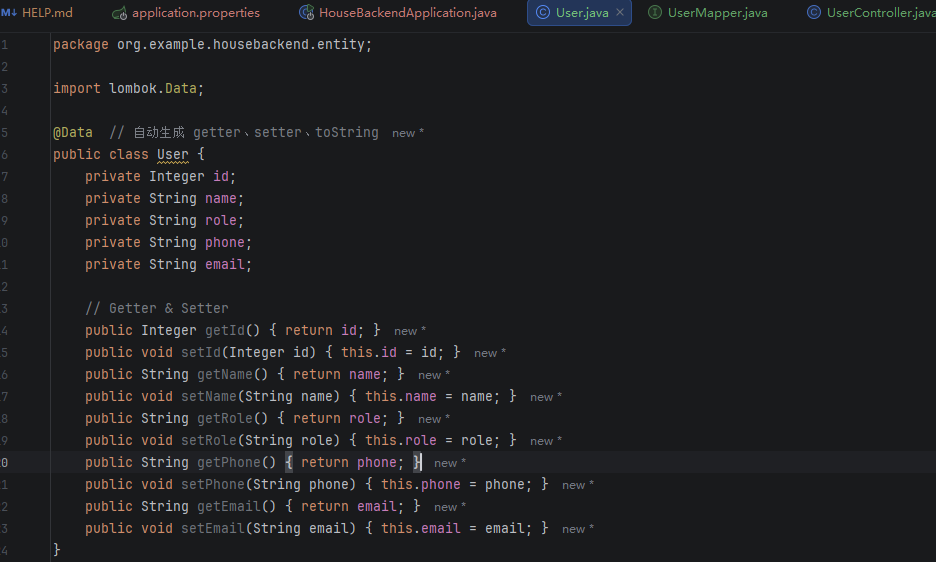
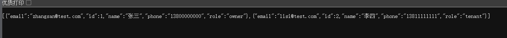

# Day03 日志(2026-06-03)

---

## 本日工作内容

### 1. 完成后端用户查询接口（User模块）

今天完成房产管理系统后端用户查询功能的开发，实现了基础的数据库读取接口。

具体工作包括：

- 完成 MySQL 数据库 `house_db` 中 `user` 表测试数据准备
- 使用 Spring Boot + MyBatis 搭建后端查询接口
- 完成以下模块开发：
  - Entity：User 实体类
  - Mapper：UserMapper 接口
  - Mapper XML：UserMapper.xml（SQL语句配置）
  - Controller：UserController（REST API接口）

User 实体类展示



---

### 2. 实现用户查询接口（GET /users）

成功实现用户查询接口：

GET http://localhost:8080/users
功能说明：

- 查询 `user` 表所有用户信息
- 返回 JSON 格式数据

示例返回结果：

```json
json
[
  {
    "id": 1,
    "name": "张三",
    "role": "owner",
    "phone": "13800000000",
    "email": "zhangsan@test.com"
  },
  {
    "id": 2,
    "name": "李四",
    "role": "tenant",
    "phone": "13811111111",
    "email": "lisi@test.com"
  }
]
```

跟昨天插入的数据内容是一致的，看来是跑起来了。
但是在浏览器里显示的很丑



### 3. 前后端交互流程验证

本日成功验证完整数据流：
    前端请求 → Controller → Service → Mapper → MySQL → 返回JSON → 前端

对 Spring Boot 分层结构有了更清晰的理解：

* Controller：接收请求
* Service：处理业务逻辑
* Mapper：操作数据库

* * *

### 4. 前端调用测试

通过 fetch 成功访问后端接口：

```javascript
fetch("http://localhost:8080/users")  
.then(res => res.json()) 
.then(data => console.log(data));
```

* * *

技术收获
-------

* 掌握 Spring Boot RESTful API 基本开发流程
* 理解 MyBatis Mapper 与 SQL 映射关系
* 理解前后端分离架构的数据流转方式
* 完成第一个完整“前端 → 后端 → 数据库”闭环
