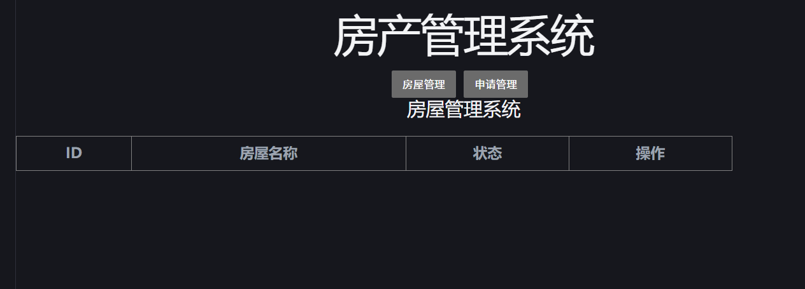

# Day04日志(2026-06-04)

**完成内容：**

- 后端完成 Application 模块：
  
  - Application Entity / Mapper / Service / Controller
  - 实现接口：
    - GET `/applications`：获取申请列表
    - PUT `/applications/assign/{id}`：处理分房申请

- 前端开发 ApplicationList.vue 页面：
  
  - 显示申请列表
  - 实现分房按钮功能
  - 成功联动后端接口，实现分房操作实时更新
  
  页面展示如下，有点丑后续会优化
  

- 完成后端 House 模块和 Application 模块接口联动测试

- 前端通过 Vue fetch 成功获取 JSON 数据，页面可以显示申请信息

**问题记录：**

- 前端页面最初只显示房屋管理模块
- Service 注入 Mapper 时出现空指针（已解决）
- 把该写在house.vue的内容写到user.vue 文件里了，找了半天错误。

**解决方案：**

- 修改 App.vue，将 ApplicationList.vue 组件引入
- 检查 Spring Bean 注解和构造器注入，保证 Mapper 被正确注入

**次日计划：**

- 完成 HousingRecord 模块开发（已分配住房记录管理）
- 开发 HousingStandard 模块（住房标准管理）
- 完善前端页面，支持切换模块视图
- 准备前后端完整联调测试
