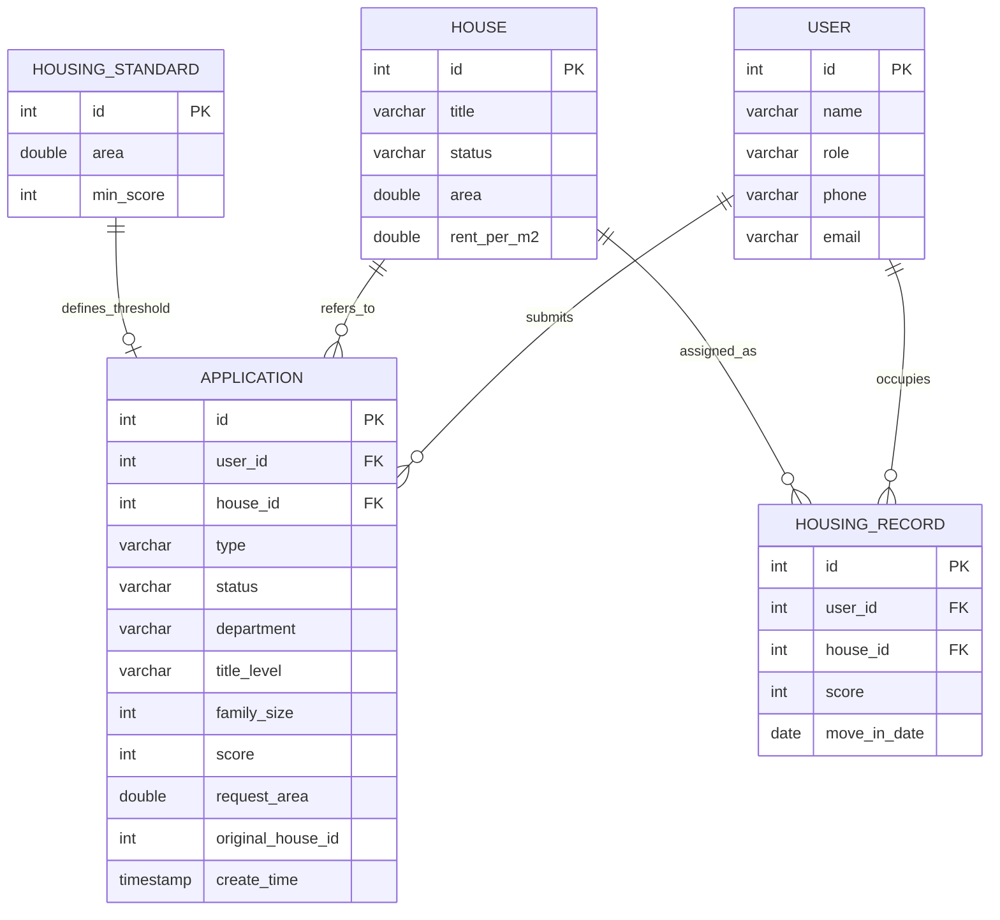

# 房产管理系统 — 数据库设计报告

> **项目名称**：房产管理系统  
> **数据库名称**：`house_db`  
> **数据库系统**：MySQL 9.7  
> **ORM 框架**：MyBatis  
> **设计日期**：2026-06

---

## 一、数据库概述

### 1.1 设计目标

本数据库为「房产管理系统」提供数据持久化支持，核心目标是：

- 存储用户信息（住户 / 管理员）
- 管理房屋资源及其状态
- 记录分房、调房、退房三类申请及其审批流转
- 维护住房标准（面积-分数阈值映射）
- 持久化已分配的住房记录

### 1.2 数据库字符集

| 属性     | 值         |
| -------- | ---------- |
| 字符集   | UTF-8      |
| 排序规则 | utf8mb4_general_ci |
| 存储引擎 | InnoDB     |

> 说明：当前 SQL 脚本未显式指定字符集，实际部署时建议添加 `CHARACTER SET utf8mb4 COLLATE utf8mb4_unicode_ci`。

---

## 二、ER 图（实体关系图）



### 实体关系说明

| 关系 | 类型 | 说明 |
| --- | --- | --- |
| User → Application | 1:N | 一个用户可提交多份申请 |
| House → Application | 1:N | 一套房屋可被多次申请引用 |
| User → HousingRecord | 1:N | 一个用户可有多条住房记录（历史） |
| House → HousingRecord | 1:N | 一套房屋可有多条分配记录 |
| HousingStandard → Application | 1:N（逻辑） | 住房标准用于校验申请是否达标 |

---

## 三、表结构详细设计

### 3.1 用户表 `user`

存储系统用户（住户 / 管理员）的基本信息。

```sql
CREATE TABLE user (
    id INT PRIMARY KEY AUTO_INCREMENT,
    name VARCHAR(50),
    role VARCHAR(20),     -- 'owner' | 'tenant'
    phone VARCHAR(20),
    email VARCHAR(100)
);
```

| 字段 | 类型 | 约束 | 说明 |
| --- | --- | --- | --- |
| `id` | INT | PK, AUTO_INCREMENT | 用户唯一标识 |
| `name` | VARCHAR(50) | — | 用户姓名 |
| `role` | VARCHAR(20) | — | 角色：`owner`（房主/管理员）、`tenant`（住户） |
| `phone` | VARCHAR(20) | — | 联系电话 |
| `email` | VARCHAR(100) | — | 电子邮箱 |

---

### 3.2 房屋表 `house`

记录所有房屋资源的信息和状态。

```sql
CREATE TABLE house (
    id INT PRIMARY KEY AUTO_INCREMENT,
    title VARCHAR(100),
    status VARCHAR(20),      -- '空房' | '已分配'
    area DOUBLE,
    rent_per_m2 DOUBLE
);
```

| 字段 | 类型 | 约束 | 说明 |
| --- | --- | --- | --- |
| `id` | INT | PK, AUTO_INCREMENT | 房屋唯一标识 |
| `title` | VARCHAR(100) | — | 房屋名称/编号（如 A101） |
| `status` | VARCHAR(20) | — | 房屋状态：`空房` / `已分配` |
| `area` | DOUBLE | — | 房屋面积（㎡） |
| `rent_per_m2` | DOUBLE | — | 每平方米月租金（元） |

**状态流转**：

```
空房 ──[分房]──▶ 已分配
已分配 ──[退房]──▶ 空房
已分配 ──[调房]──▶ 空房（原房） + 已分配（新房）
```

---

### 3.3 申请表 `application`

记录分房、调房、退房三类申请及其审批状态。

```sql
CREATE TABLE application (
    id INT PRIMARY KEY AUTO_INCREMENT,
    user_id INT,
    house_id INT,
    type VARCHAR(20),            -- ALLOCATE / TRANSFER / RETURN
    status VARCHAR(20),          -- PENDING / APPROVED / REJECTED
    department VARCHAR(50),
    title_level VARCHAR(50),
    family_size INT,
    score INT,
    request_area DOUBLE,
    original_house_id INT,
    create_time TIMESTAMP DEFAULT CURRENT_TIMESTAMP,
    FOREIGN KEY (user_id) REFERENCES user(id),
    FOREIGN KEY (house_id) REFERENCES house(id)
);
```

| 字段 | 类型 | 约束 | 说明 |
| --- | --- | --- | --- |
| `id` | INT | PK, AUTO_INCREMENT | 申请唯一标识 |
| `user_id` | INT | FK → user(id) | 申请人 ID |
| `house_id` | INT | FK → house(id) | 目标房屋 ID（分房/调房时指定） |
| `type` | VARCHAR(20) | — | 申请类型：`ALLOCATE` / `TRANSFER` / `RETURN` |
| `status` | VARCHAR(20) | — | 申请状态：`PENDING` / `APPROVED` / `REJECTED` |
| `department` | VARCHAR(50) | — | 申请者所属部门 |
| `title_level` | VARCHAR(50) | — | 职称等级（如 讲师、副教授、教授） |
| `family_size` | INT | — | 家庭人数 |
| `score` | INT | — | 综合评分（用于分房排序） |
| `request_area` | DOUBLE | — | 申请面积（㎡） |
| `original_house_id` | INT | — | 调房申请中原房屋 ID |
| `create_time` | TIMESTAMP | DEFAULT NOW | 申请创建时间 |

**申请类型说明**：

| type 值 | 中文含义 | 触发业务 |
| --- | --- | --- |
| `ALLOCATE` | 分房申请 | 计算分数 → 排队 → 分配空房 |
| `TRANSFER` | 调房申请 | 释放原房 → 分配新房 |
| `RETURN` | 退房申请 | 释放房屋 → 标记为空房 |

**状态流转**：

```
PENDING ──[审批通过]──▶ APPROVED
PENDING ──[审批拒绝]──▶ REJECTED
```

---

### 3.4 住房标准表 `housing_standard`

定义不同面积档位所需的最低分数阈值。

```sql
CREATE TABLE housing_standard (
    id INT PRIMARY KEY AUTO_INCREMENT,
    area DOUBLE,
    min_score INT
);
```

| 字段 | 类型 | 约束 | 说明 |
| --- | --- | --- | --- |
| `id` | INT | PK, AUTO_INCREMENT | 标准唯一标识 |
| `area` | DOUBLE | — | 面积档位（㎡） |
| `min_score` | INT | — | 该面积档位的最低分数要求 |

**示例数据**：

| area（面积） | min_score（最低分） | 含义 |
| --- | --- | --- |
| 50 ㎡ | 60 分 | 申请 50㎡ 房屋需 ≥60 分 |
| 80 ㎡ | 80 分 | 申请 80㎡ 房屋需 ≥80 分 |
| 120 ㎡ | 100 分 | 申请 120㎡ 房屋需 ≥100 分 |

---

### 3.5 住房记录表 `housing_record`

记录已分配的住房关系（谁住哪套房、何时入住）。

```sql
CREATE TABLE housing_record (
    id INT PRIMARY KEY AUTO_INCREMENT,
    user_id INT,
    house_id INT,
    score INT,
    move_in_date DATE,
    FOREIGN KEY (user_id) REFERENCES user(id),
    FOREIGN KEY (house_id) REFERENCES house(id)
);
```

| 字段 | 类型 | 约束 | 说明 |
| --- | --- | --- | --- |
| `id` | INT | PK, AUTO_INCREMENT | 记录唯一标识 |
| `user_id` | INT | FK → user(id) | 住户 ID |
| `house_id` | INT | FK → house(id) | 分配房屋 ID |
| `score` | INT | — | 分配时的评分（用于审计追溯） |
| `move_in_date` | DATE | — | 入住日期 |

---

## 四、数据关系矩阵

|  | user | house | application | housing_standard | housing_record |
| --- | :-: | :-: | :-: | :-: | :-: |
| **user** | — | — | 1:N | — | 1:N |
| **house** | — | — | 1:N | — | 1:N |
| **application** | N:1 | N:1 | — | N:1（逻辑） | — |
| **housing_standard** | — | — | — | — | — |
| **housing_record** | N:1 | N:1 | — | — | — |

---

## 五、索引设计建议

> 当前数据库脚本未定义显式索引（除主键和外键自带索引外）。建议按以下策略补充：

| 表 | 建议索引 | 索引类型 | 理由 |
| --- | --- | --- | --- |
| `user` | `idx_role` | 普通索引 | 按角色筛选用户 |
| `house` | `idx_status` | 普通索引 | 快速查询空房列表 |
| `application` | `idx_user_id` | 普通索引 | 按申请人查询 |
| `application` | `idx_status` | 普通索引 | 按状态筛选待审批申请 |
| `application` | `idx_type_status` | 联合索引 | 按类型+状态组合查询 |
| `housing_record` | `idx_user_id` | 普通索引 | 按用户查住房记录 |
| `housing_record` | `idx_house_id` | 普通索引 | 按房屋查分配记录 |

**建索引 SQL 示例**：

```sql
CREATE INDEX idx_house_status ON house(status);
CREATE INDEX idx_app_status ON application(status);
CREATE INDEX idx_app_type_status ON application(type, status);
CREATE INDEX idx_record_user ON housing_record(user_id);
```

---

## 六、测试数据

当前数据库已预置以下测试数据：

### 用户

| id | name | role | phone | email |
| --- | --- | --- | --- | --- |
| 1 | 张三 | owner | 13800000000 | zhangsan@test.com |
| 2 | 李四 | tenant | 13811111111 | lisi@test.com |

### 房屋

| id | title | status | area | rent_per_m2 |
| --- | --- | --- | --- | --- |
| 1 | A101 | 空房 | 50 | 10 |
| 2 | A102 | 空房 | 80 | 12 |
| 3 | B201 | 已分配 | 120 | 15 |

### 住房标准

| id | area | min_score |
| --- | --- | --- |
| 1 | 50 | 60 |
| 2 | 80 | 80 |
| 3 | 120 | 100 |

### 住房记录

| id | user_id | house_id | score | move_in_date |
| --- | --- | --- | --- | --- |
| 1 | 1 | 3 | 105 | 当前日期 |

### 申请

| id | user_id | type | status | department | title_level | family_size | score | request_area |
| --- | --- | --- | --- | --- | --- | --- | --- | --- |
| 1 | 2 | ALLOCATE | PENDING | 计算机学院 | 讲师 | 3 | 85 | 80 |

---

## 七、数据库脚本说明

| 文件 | 路径 | 说明 |
| --- | --- | --- |
| `house_db.sql` | `database/house_db.sql` | 建库 + 建表 + 测试数据一体脚本 |

执行方式：

```bash
mysql -u root -p < database/house_db.sql
```

或在 Navicat 中直接执行 SQL 文件。

---

## 八、设计总结

本数据库设计遵循 **第三范式（3NF）**，核心特点：

1. **实体清晰**：用户、房屋、申请、标准、记录五大实体各司其职
2. **关系明确**：外键约束保证数据引用完整性
3. **状态可追溯**：申请状态流转 + 住房记录保留历史
4. **扩展友好**：可通过增加字段或关联表扩展（如增加审批日志表、房屋维修记录表等）

**后续优化方向**：

- 添加显式索引提升查询性能
- 增加 `admin_log` 操作日志表
- 使用枚举或代码表替代 VARCHAR 类型的状态/类型字段
- 考虑软删除（`is_deleted` 字段）代替物理删除
